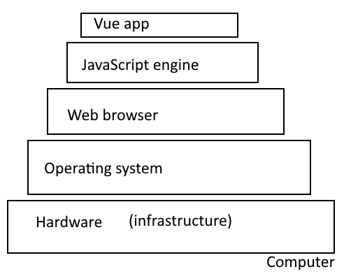
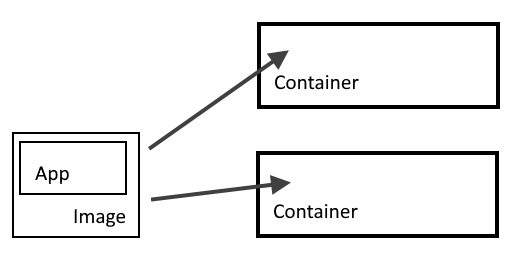

<!-- .slide: class="intro" -->
# Paketering, leverans och uppföljning
## CI/CD och Docker
###### david.andersson@zocom.se

Note: tryck S för att öppna speaker view,
F för fullscreen,
Alt + Click för att zooma in/ut,
O för Overview mode

---
<!-- .slide: class="complex pink" -->
## Idag

+ Docker
+ CI/CD

---
<!-- .slide: class="basic blue" -->
## Datorarkitektur
För att köra en frontend-app behövs många lager.

Note: Illustration av vad en frontend JavaScript webbapp behöver för att köras. Bild av mig/David

---
<!-- .slide: class="basic blue" -->
## VM = Virtual Machine
En VM är som en låda, där vi kan köra ett program isolerat från resten av datorn. "Lådan" har ett eget operativsystem. (högra bilden)

Docker skapar *containers* som körs på datorns operativsystem.

Note: Bild från https://www.docker.com/blog/containers-replacing-virtual-machines/

---
<!-- .slide: class="basic blue" -->
## Docker?

En *containerized app* fungerar likadant i olika datormiljöer!

---
<!-- .slide: class="basic blue" -->
## Docker!
+ Bygga, distribuera och köra **Docker containers**
+ Context = färdiga mallar för images, som innehåller t.ex. Linux eller Node
+ **Image** = en app som är byggd med ett context
+ **Container** = ett paket med allt som behövs för att köra en app, innehåller en image

Docker stöds av många molntjänster.

---
<!-- .slide: class="basic green" -->
## Time to get coding!

1. Installera Docker Desktop: https://www.docker.com/get-started
2. Skapa en Vue-app
3. "Dockerisera" appen: https://vuejs.org/v2/cookbook/dockerize-vuejs-app.html

---
<!-- .slide: class="basic blue" -->
## Image

En startad Docker image körs i en *container*.

En image känner inte till något utanför sin container. För att kunna ta emot HTTP requests måste vi öppna portar mellan container och image.

---
<!-- .slide: class="basic blue" -->
## Dockerfile
`Dockerfile` liknar package.json, den talar om hur avbilden (*image*) ska byggas.

| Nyckelord   | Beskrivning    |
| ----------: | :------------- |
| **FROM**    | Tala om vilken Docker *context* som ska användas som mall. För webb-appar använder vi en version av Node. |
| **WORKDIR** | Ange till vilken mapp i avbilden vår kod ska kopieras. Behövs om man vill göra något med filerna i avbilden. |
| **COPY**    | Kopiera filer från vårt filsystem till avbildens filsystem. |
| **RUN**     | Kör ett kommando i avbilden, t.ex. `npm run build`
| **EXPOSE**  | Kopplar ihop appens och avbildens portar |
| **CMD**     | Anger det kommando som ska köras när man skriver `docker run` |

Note: Node context: `node:lts-alpine`
1. börja med FROM, vilket context ska vi utgå från?
2. bygga ditt filsystem - vilka filer ska tas med?
3. metadata - bygga

Dockerfile https://github.com/dockersamples/node-bulletin-board/blob/master/bulletin-board-app/Dockerfile
+ FROM node:lts-alpine
+ WORKDIR /app
+ COPY package*.json ./
+ RUN npm install
+ RUN npm install -g http-server
+ COPY . .
+ RUN npm run build
+ CMD [ "http-server", "dist/" ]

---
<!-- .slide: class="complex blue" -->
## CI/CD
Kundens och marknadens krav kan ändras snabbt under ett projekts gång. CI/CD handlar om att snabba upp och förenkla processen att släppa nya versioner.
Små ändringar ofta!

Note: Bild från https://www.atlassian.com/continuous-delivery/principles/continuous-integration-vs-delivery-vs-deployment
+ Build - bygga appen
+ Test - köra enhetstester
+ Acceptanstest - testa att övergripande krav är uppfyllda
+ Deploy to staging - förbered appen för att publiceras
+ Deploy to production - publicera appen, "go live"
+ Smoke test - kontrollera att den publicerade appen inte kraschar

---
<!-- .slide: class="basic blue" -->
> CI is the process of integrating code into a mainline code base

#### CI = Continous Integration
+ Kombinera din kod med **master** så ofta som möjligt
+ Kör automatiserade tester när någon gör commit till master
+ Undviker "integration hell" när man får många merge-konflikter

Note: https://devops.com/continuous-integration-vs-continuous-delivery-theres-important-difference/, https://www.atlassian.com/continuous-delivery/principles/continuous-integration-vs-delivery-vs-deployment

---
<!-- .slide: class="basic blue" -->
> CD is about the processes that have to happen after code is integrated for app changes to be delivered to users.

#### CD = Continous Delivery/Deployment
Automatisering av processen att släppa en ny version av appen. Målet är att man bara ska behöva klicka på en knapp. CI ingår.
+ Testing
+ Staging
+ Deploying

Note: C. Deployment går lite längre än C. Delivery. Om testerna blir gröna ska en ny version släppas direkt, utan mänsklig interaktion.

---
<!-- .slide: class="code" -->
## Lets code!
Vi jobbar med övningarna i kursinfo
